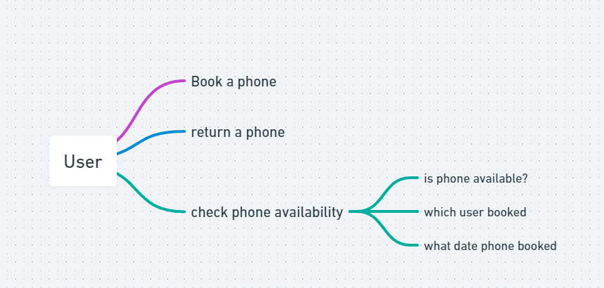

## Test mobile booking system 

## Overview 
The mobile testing application enables a software testing team to efficiently manage and share 10 mobile phones for testing purposes. Testers can book and return phones, with the system tracking availability, booking times, and user details

## Use cases 
Following are the main use cases for this application 



### Usecases
```text
1. View Phone Inventory:
    As a user, I want to see a list of available phones for testing.

2. Book a Phone:
    As a user, I want to select a phone and book it for testing, providing my name.
    
3. Return a Phone:
    As a user, I want to return a booked phone.

4. Check Phone Availability:
    As a user, I want to check if a specific phone is available for testing.
```


## Class diagram 


### Design considerations
1. Used command design patterns to gather user action 
2. Concurrency handled using ReentrantLock if multi users try to book at same time 
3. Data store managed in memory level, but this can easily move to DB 
4. Tester's validation is out of scope, can can easily integrate 
5. command and singleton patterns are used for this simplified version 
6. Test cases are available in test package 


